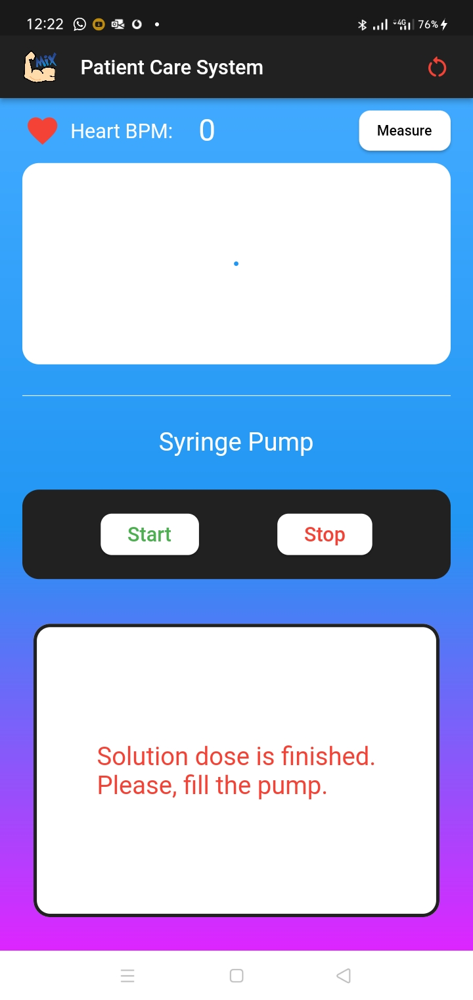
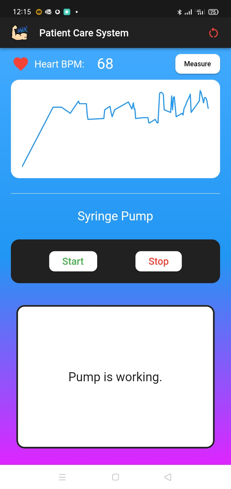
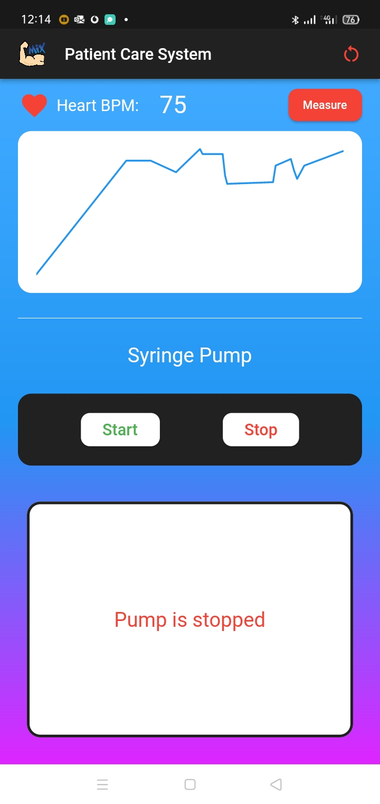
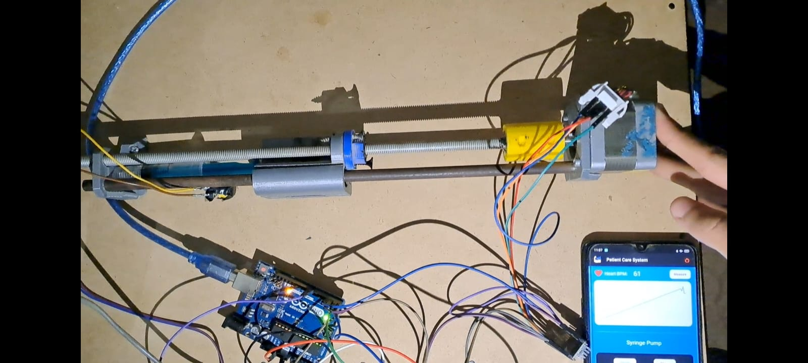
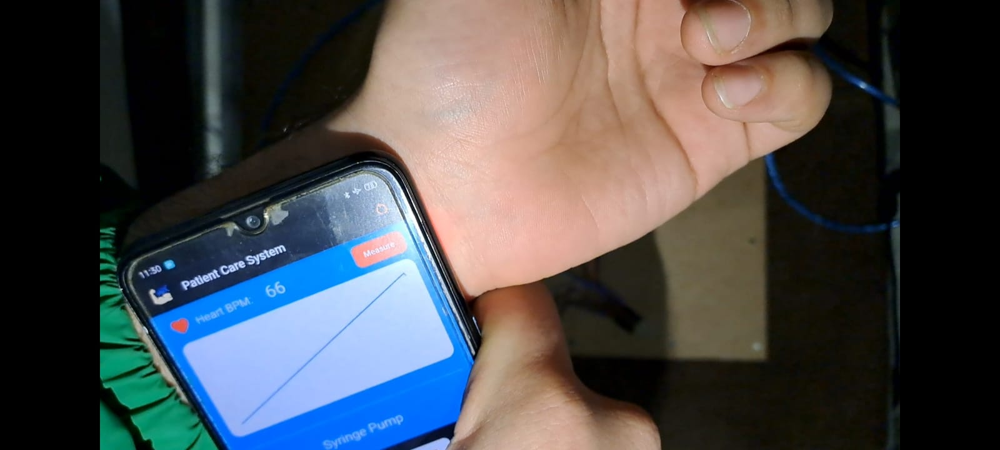

# Patient Care System
- Measuring and monitoring heart beats rate and controlling drugs delivering to patient through syringe pump, and alarming system notifcations.

## Technologies
- Flutter
- Arduino C

## Screenshots
  

  
